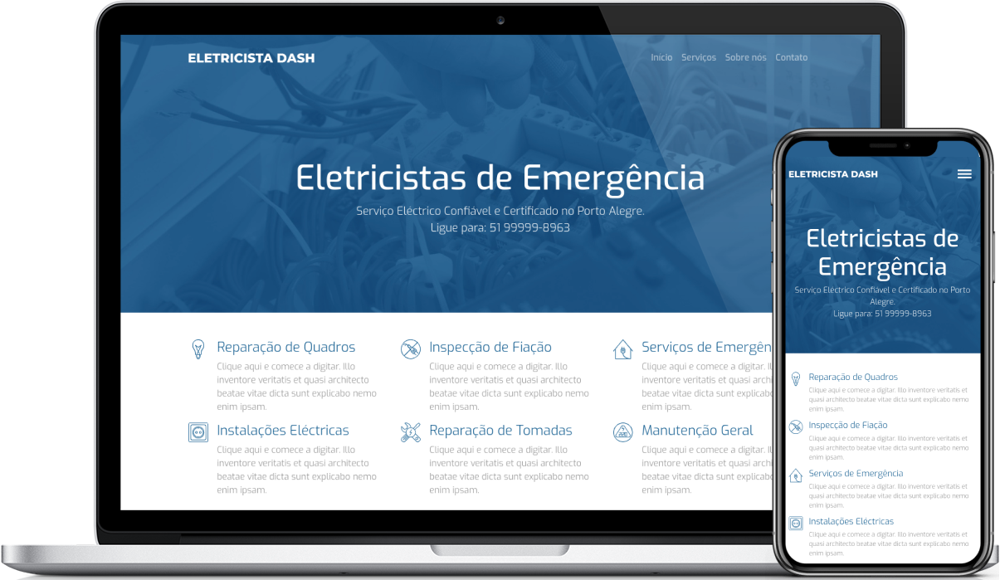

<h1 align="center">
    
</h1>

  <a href="#-tecnologias">Tecnologias</a>&nbsp;&nbsp;&nbsp;|&nbsp;&nbsp;&nbsp;
  <a href="#-projeto">Projeto</a>&nbsp;&nbsp;&nbsp;|&nbsp;&nbsp;&nbsp;
  <a href="#-layout">Start Projeto</a>&nbsp;&nbsp;&nbsp;|&nbsp;&nbsp;&nbsp;
  <a href="#-licença">Licença</a>

    
    
    

 

  

## 🚀 Tecnologias

Esse projeto foi desenvolvido com as seguintes tecnologias:

- [HTML5](https://htmlreference.io/)
- [CSS3](https://cssreference.io/)
- [Bootstrap](https://getbootstrap.com/)
- [Javascript](https://developer.mozilla.org/pt-BR/docs/Web/JavaScript)
- [Typescript](https://www.typescriptlang.org/)
- [Node.js](https://nodejs.org/en/)
- [Angular](https://angular.io/)
- [Netlify](https://www.netlify.com/)

## 💻 Projeto

Eletricista Dash realiza instalação elétrica, quadro de luz, transformação 110v para 220v, troca da fiação, quadro de distribuição de energia, disjuntores, instalação e manutenção na rede elétrica, predial e residencial. Realizamos serviços emergenciais, eletricista 24 horas.

## 🚀 Start Projeto

- Clone o repositório
- Instale as dependências com `npm install`
- Inicie o servidor com `ng serve`

Agora você pode acessar [`localhost:4200`](http://localhost:4200) do seu navegador.

## 🌐 Implementação no Netlify

Acesse [`https://web-eletricista-dash.herokuapp.com/`](https://web-eletricista-dash.herokuapp.com/) do seu navegador.

## 📝 Licença

Esse projeto está sob a licença MIT. Veja o arquivo [LICENSE](LICENSE.md) para mais detalhes.

---

Feito com por Jessé Martins
